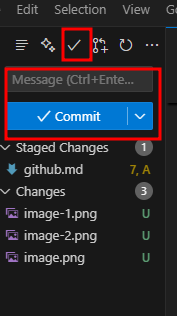

# how to upload file vs code to git hub 
- 1. install git  from this link [git download](https://git-scm.com/download/win)
  
- 2. add username on git from this command 
  - open git cmd
  - git config --global user.name "username"
  - git config --global user.email "email"
- 3. phr vs code ma aa jna ha 
  - 
  - idr click krna 
  - 
  - us k bad idr
   
  - idr se hum is ko commit kry g